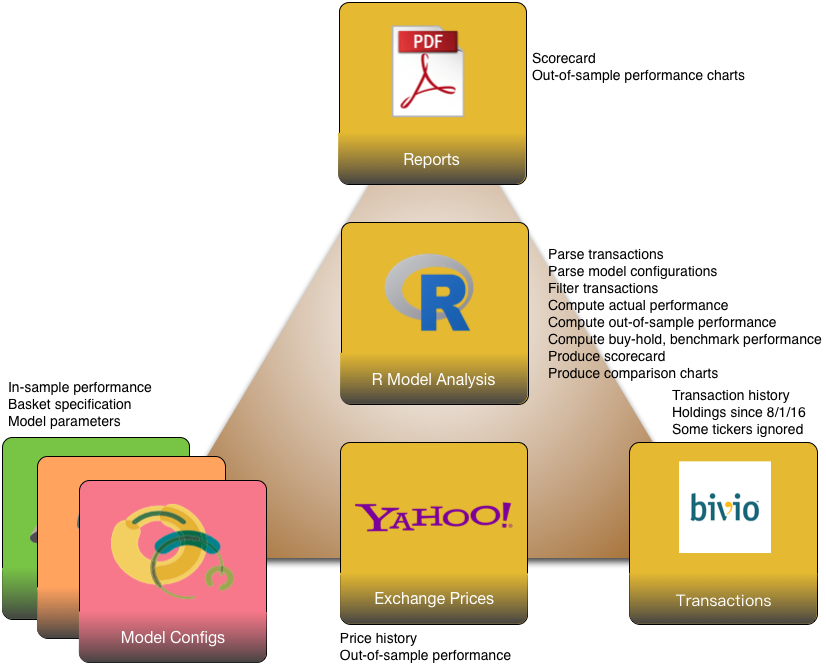
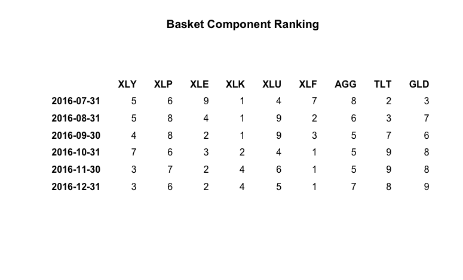
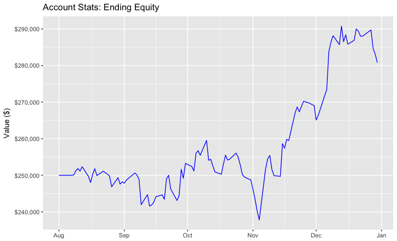
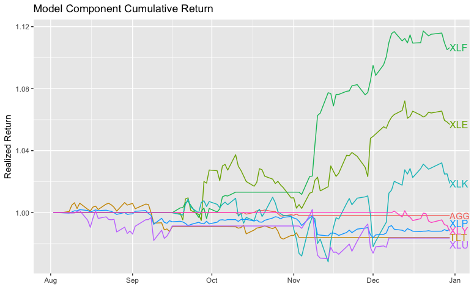
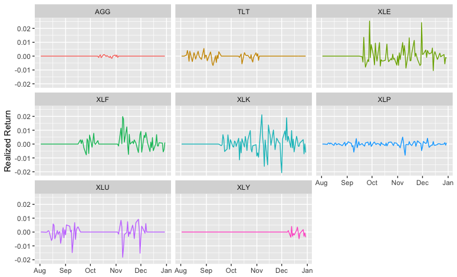
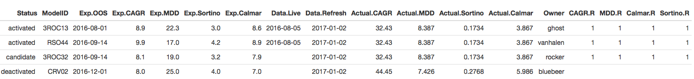
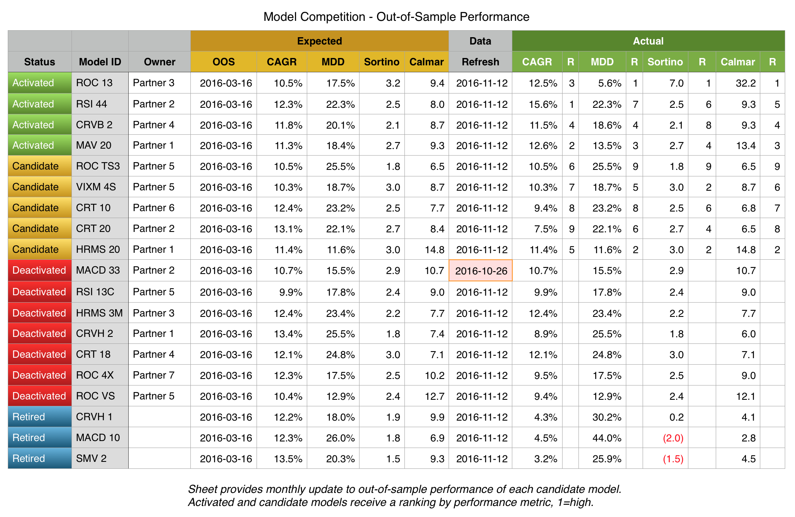
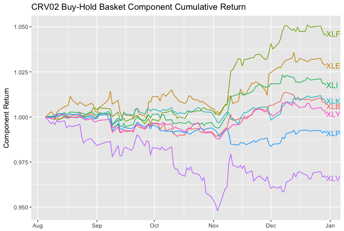
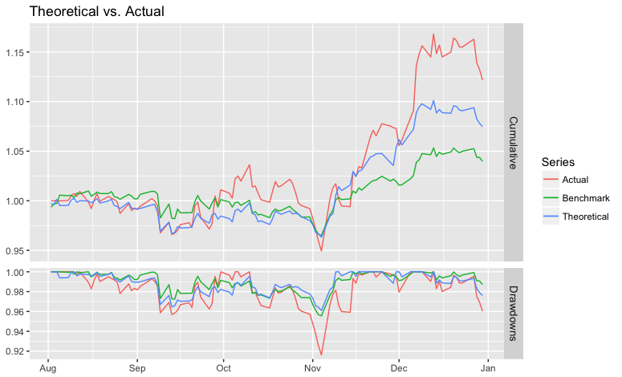
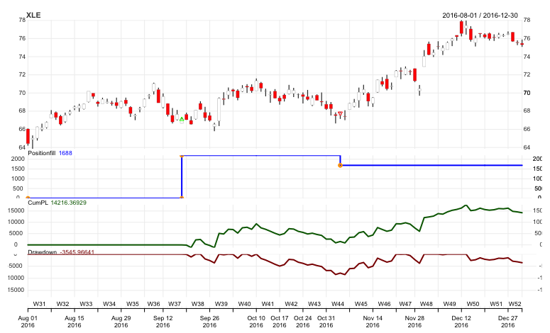

# Introduction

## Synopsis

* We have several models backtested and validated, and we have money invested
in only a few of them.  Each month, how do we decide which models to
activate or deactivate?   
* We discussed in Dallas the scorecard and relegation.
* Scorecard and automation implementation is underway.
* This presentation is an implementation progress report. 

## Progress

- Good progress already achieved in risk-reducing tasks.
- Prototypes wired together for integration testing. 
- Progress reports elicit feedback on content and direction. 

## Design Scenario

- Export transaction history from Bivio into XML
- Define model configurations in YAML
- Read Bivio XML to collect _actual_ transacitons
- Read model configurations for performance attribution
- Fetch price history from Yahoo!
- Compute expected, out-of-sample, and actual performance
- Build scorecard and backing charts

## Design Scenario

# Scorecard

## Working Prototypes

* Transaction history extraction from Bivio export.
* Transaction filtering to ETP model start 8/1/16.
* Model definition files containing _expected_ performance.
* Model update functions containing _theoretical_ OOS performance.
* Transaction replay for _actual_ OOS performance.

## Future Work

* Domain reconfiguration (in progress).
* Cloud hosting compute infrastructure.
* Clock triggers.
* CM automation for result commit to repository.
* Auto-blog posts.
* Automating Bivio export

----

Scorecard workflow status

----

Model recommendations

----

Account ending equity

----

Model components as traded

----

Model returns as traded

----

Scorecard 

----

Target Scorecard (as shown in Dallas)

----

Buy-Hold model basket comparisons

----

Theoretical vs. Actual

----

Individual basket component positions

# Backup

## Metrics

* CAGR percentage, monthly returns
* Maximum drawdown MDD magnitude percentage, any peak to trough
* Sortino ratio, $S = (R-T) / D_R$, excess return over downside deviation
* Calmar ratio, $C = CAGR / MDD$, monthly with 36-month lookback

## Performance Tracking

* Compute actual metric values for all activated models
* Compute out-of-sample metric values for all other models
* Track in performance book
    + Actual vs. in-sample expected metrics
    + Out-of-sample vs. in-sample expected metrics

## Activation

* _Activation_ refers to placing a model into portfolio; it becomes investable but may have zero weighting
* _Deactivation_ refers to removing a model from portfolio, moving from activated tier to candidate tier; it continues tracking but is not invested

## Issues

* Transaction history does not tease out cash allocation
* Actual performance does not account for cash.
* Transaction history does not allocate shared ETP purchases across models

----

# Relegation and Promotion

----

Model promotion from candidate to activated

----

Model relegation from activated to candidate

----

Model relegation from candidate to deactivated

----

Model retirement

