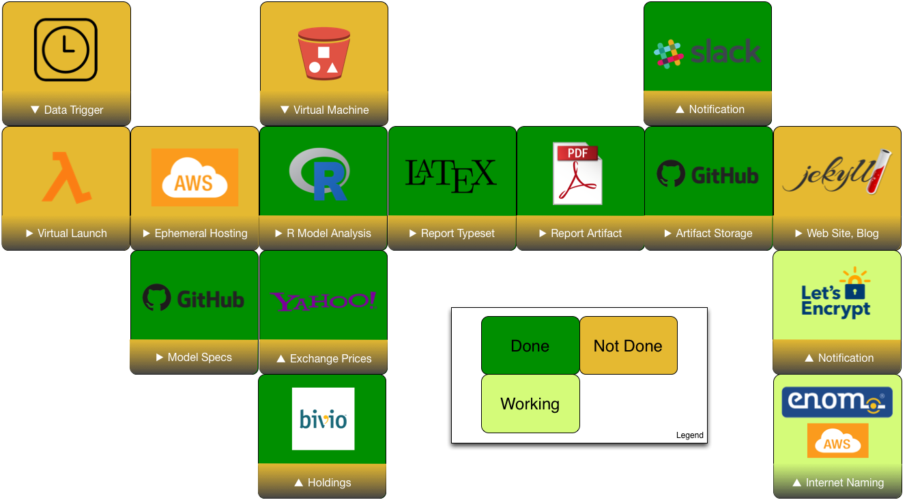
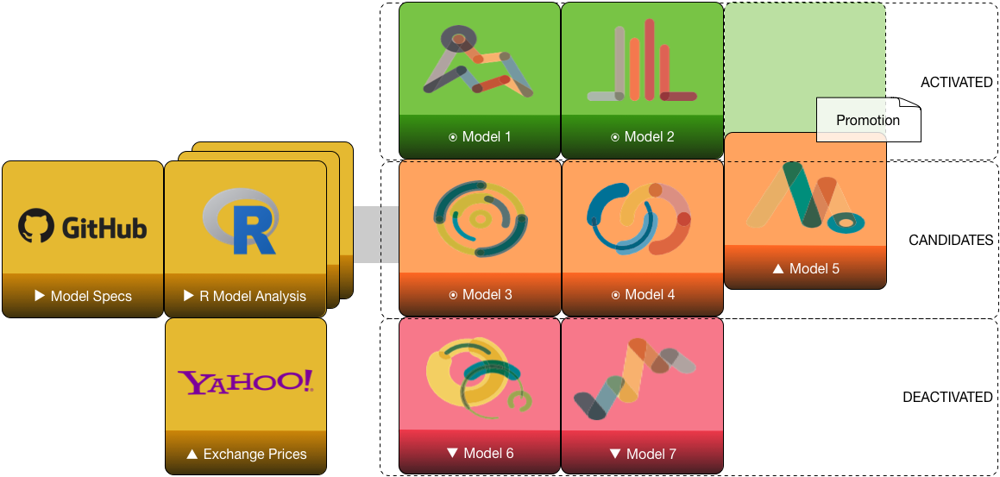
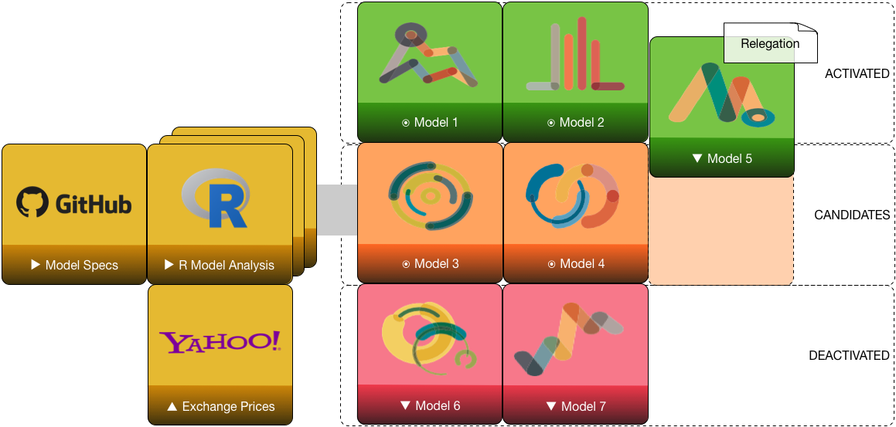
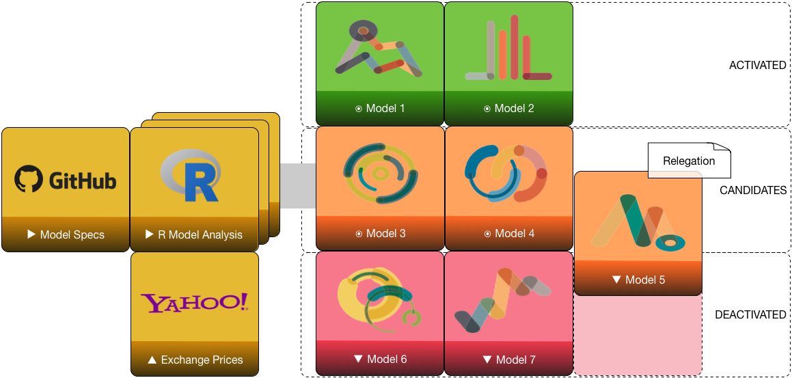
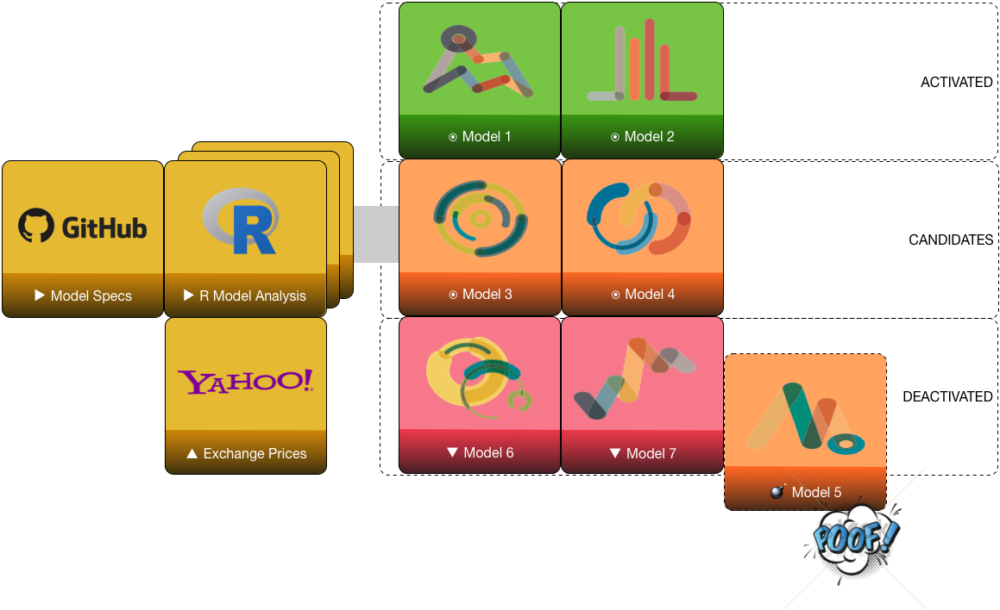

# Introduction

## Syopsis

* We have several models backtested and validated, and we have money invested
in only a few of them.  Each month, how do we decide which models to
activate or deactivate?   
* We discussed this in Dallas. 
* Implementation of automated scorecard is underway.

## Progress

- Much progress has been made in its implementation toward automation. 
- Implementation requires one file export, data collection, and several moving parts.

# Scorecard

## Working Parts

* Transaction history extraction from Bivio export.
* Transaction filtering to ETP model start 8/1/16.
* Model definition files containing _expected_ performance.
* Model update functions containing _theoretical_ OOS performance.
* Transaction replay for _actual_ OOS performance.

## Future Work

* Cloud hosting compute infrastructure.
* Data clock triggers.
* CM automation for result commit to repository.
* Auto-blog posts.

----

Scorecard workflow status

# Backup

## Metrics

* CAGR percentage, monthly returns
* Maximum drawdown MDD magnitude percentage, any peak to trough
* Sortino ratio, $S = (R-T) / D_R$, excess return over downside deviation
* Calmar ratio, $C = CAGR / MDD$, monthly with 36-month lookback

## Performance Tracking

* Compute actual metric values for all activated models
* Compute out-of-sample metric values for all other models
* Track in performance book
    + Actual vs. in-sample expected metrics
    + Out-of-sample vs. in-sample expected metrics

## Activation

* _Activation_ refers to placing a model into portfolio; it becomes investable but may have zero weighting
* _Deactivation_ refers to removing a model from portfolio, moving from activated tier to candidate tier; it continues tracking but is not invested

## Issues

* Transaction history does not tease out cash allocation
* Actual performance does not account for cash.
* Transaction history does not allocate shared ETP purchases across models

----

# Relegation and Promotion

----

Model promotion from candidate to activated

----

Model relegation from activated to candidate

----

Model relegation from candidate to deactivated

----

Model retirement

